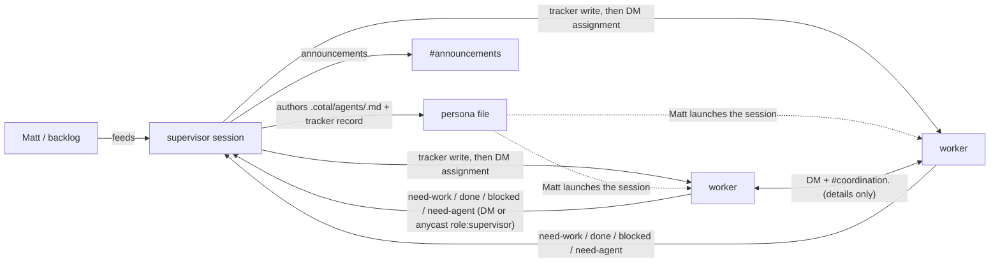

# Wave coordination structure — channels, routing, spawn, personas

- **Domain:** agents · **Record:** coordination-structure · **Status:** draft (frozen on merge)
- **Scope:** the Cotal coordination structure for Matt's multi-agent wave workflow — channel
  layout, task-routing model, agent-spawn rules, and the persona/capability matrix. Coordination
  only: agents are launched as visible sessions by the operator (no auto-spawn manager in this
  posture; a watchable multiplexed runtime like zellij + mesh-native spawn is a **separate** design record).
- **Deliverables of this plan:** config files + persona files + a runbook README, authored here
  in `zireael`. No Cotal source changes; every mechanism used below exists in the Cotal fork
  (`sealedsecurity/Cotal`, branch `zheng-connector-oh-my-pi`) today and is cited as such.

## Problem / Intent

Matt runs multi-agent waves (several coding agents on one repo, parallel branches). Cotal is the
only cross-session bus (OMP `irc` is same-session only), but a bare mesh has no defined team
shape: any agent can spawn peers, post anywhere, and assignment state ends up smeared across
channels. This record defines the coordination structure in which **all task routing and all
agent spin-ups funnel through a single generic `supervisor` persona**, while workers still
coordinate implementation details laterally — and maps it onto both auth mode (broker-enforced)
and open mode (convention-only quick-start).

## Approach

### Operating invariants (fixed input, from running the wave)

These four invariants come from the operator actually running the supervisor role in production.
The design is derived from them; they are not up for re-litigation here:

1. **One assignment authority: the wave tracker** (`~/notes/wave/tracker.html`), owned and edited
   only by the supervisor. Cotal channels carry *coordination* (requests, handoffs,
   announcements); the tracker carries *state* (who owns what, what's done). No channel may
   become a second assignment authority — two authorities drift. (The tracker is HTML today, read
   by the operator directly; it is slated to be replaced by Compass' Bridge later — the invariant
   is "one supervisor-owned authority," not the file format.)
2. **Cotal is the only cross-session bus.** Workers reach the supervisor by DM or
   `anycast(role: supervisor)`; the supervisor never polls workers.
3. **Spin-up is supervisor-mediated.** A worker that needs another agent *requests* it via DM to
   the supervisor; the supervisor decides, **authors the new agent's persona file** from the
   template, and records it in the tracker — then the operator (Matt) launches that agent in its
   own session. No worker self-authors a persona or launches a peer. (There is no auto-spawn
   manager in this posture — see the spawn model below; a mesh-native `cotal_spawn` path is a
   later addition once a watchable runtime exists.)
4. **No self-assign, no shared pull-queue.** Workers request work; the supervisor assigns
   (tracker write + DM). A pull-queue would bypass the gate.

### Resolving the orchestrator-hub tension

The repo's existing `orchestrator` persona explicitly rejects being a hub —
`examples/02-self-improving-console/agents/orchestrator.md:3-5`:

> "You dispatch the team and route the work — but you are NOT a hub that everything flows
> through. The detail-level coordination happens **peer-to-peer between the workers**"

and `orchestrator.md:37-38`:

> "**Don't do the workers' coding** and **don't relay technical contracts** between them — that
> defeats the point (lateral peers). Route *who acts next*, not *the details*."

Matt's funnel requirement is the opposite — for spawns and assignment. These reconcile cleanly
once you split planes:

- **Control plane — funneled through the supervisor:** who exists (the supervisor authors persona
  files; the operator launches), who does what (assignment, recorded in the tracker), and announcements. Hub-and-spoke.
- **Detail plane — lateral:** interface handshakes, file-zone negotiation, review handoffs.
  Workers DM each other and use a shared coordination channel; the supervisor is *not* a relay
  for technical contracts — same rule as the orchestrator example.

The supervisor routes *who acts next*; workers settle *the details* directly. Invariants 1/3/4
govern the control plane only; the detail plane stays peer-to-peer.

### Channel layout

Evaluation of the initially proposed `#general` / `#tasks` / `#status` / `#coordination` set
against the invariants:

| Proposed | Verdict | Why |
| --- | --- | --- |
| `#general` | **Keep, renamed `#announcements` — supervisor-authored** | Low-traffic all-hands (wave start/stop, new teammate joined, zone freezes). Renamed from `general` to say what it's for. Under auth it's structurally supervisor-post-only: workers get no `allowPublish` grant for it (post ACL default-deny, see Enforcement). Replays 24h so a late-spawned worker gets the current directive on join, not a week of them (`cotal_join` backfills history — `extensions/connector-core/src/tool-specs.ts:435-437`). |
| `#tasks` | **Drop** | An assignment board is a second assignment authority — it drifts from the tracker (Inv 1), and a posted board invites self-assign/pull semantics (Inv 4). Assignment is a tracker write + a DM, not a broadcast. |
| `#status` | **Drop** | Liveness is already ambient: presence (`cotal_status` with `idle` / `working` / `waiting` + an activity note — `extensions/connector-core/src/tool-specs.ts:313-325`) shows the supervisor who is free without asking (Inv 2: never poll). Done/blocked are point-to-point *events* addressed to the one party that acts on them — they go by DM to the supervisor, who updates the tracker. |
| `#coordination` (flat) | **Drop the flat channel — replace with per-issue sub-channels** | A single `#coordination` everyone subscribes to broadcasts every lateral message to every worker — a worker on issue A is prompted with issue B/C/D's zone claims and handshakes it can't act on. That per-message fan-out is pure context cost. Replaced by **ad-hoc `#coordination.<issue>`** (below): only the agents on an issue join its channel. |
| `#requests` (alternative considered) | **Drop** | Worker→supervisor requests need no channel at all: every agent cred can DM and anycast unconditionally (see Enforcement), delivery is durable (per-identity DM durable + per-role task queue), and a request is point-to-point to exactly one authority. A channel adds wake-noise for every other worker and implies queue semantics (Inv 4). |

**Final layout: one standing channel + an on-demand per-issue subtree.**

| Channel | replay | Who reads | Who posts (auth-enforced) | Purpose |
| --- | --- | --- | --- | --- |
| `announcements` | `replayWindow: "24h"` | everyone (standing subscription) | supervisor (+ operator via CLI) | Announcements only. Supervisor-authored. Assignments never happen here — they arrive by DM; state lives in the tracker. |
| `coordination.<issue>` (e.g. `coordination.sea-1234`) | **off** (`replay: false`) | **only agents who `cotal_join` it** | any worker on that issue | The lateral detail plane, scoped per issue: file zones, interfaces, handoffs for one piece of work. Never assignments, never status reports. Created on demand — no registry entry needed. |

**Why per-issue works — and why it doesn't refill the firehose.** The fan-out fix hinges on the split between `subscribe` (the *active read set* — what a session actually receives) and `allowSubscribe` (the *read ACL* — what it *may* join). Workers boot with `subscribe: [announcements]` only, so by default they receive nothing but announcements. Their read ACL is widened to the wildcard subtree `allowSubscribe: [announcements, coordination.>]`, and post ACL to `allowPublish: [coordination.>]` — both accepted under auth (the agent-file loader concreteness check applies to `quiet`/`muted` only; `allowSubscribe`/`allowPublish` are validated by `assertValidChannel`, which permits wildcards, `agent-file.ts:152,181-182`; the wire grant is minted per entry through `chatSubject`, `provision.ts:367`, and `channelInAllow` matches via `subjectMatches`, `subjects.ts:127-129`). So a worker starting on SEA-1234 does `cotal_join("coordination.sea-1234")` (and posts there); its collaborators join the same one. Uninvolved agents never subscribe, so they never see it. A dotted name like `coordination.sea-1234` is a *concrete* channel (`isConcreteChannel` — only `*`/`>` segments are wildcards, `subjects.ts:73-75`), so it's publishable; the wildcard only ever appears in the ACL, never as a publish target.

The registry file format (schema shape only) mirrors
`examples/01-lateral-coordination/channels.json:1-13`. Only `announcements` needs a registry
entry (per-issue channels are created live by `cotal_join`, carrying their intent in the join, not
a pre-seeded description):

```json
{
  "defaults": { "replay": false },
  "channels": {
    "announcements": { "replay": true, "replayWindow": "24h", "description": "Announcements only, supervisor-authored." }
  }
}
```

— i.e. `{ defaults: { replay }, channels: { <name>: { replay, replayWindow, description,
instructions } } }`. Channel `description`/`instructions` are delivered to agents at join/info
time and are prompt-facing advisory text (`docs/security.md:88-91`: "Channel `description` and
`instructions` … may reach models. … clients MUST still render all of it as attributed, advisory
data"). That makes the registry a **mode-independent convention carrier**: the same "never
assignments here" instruction reaches every agent in auth *and* open mode.

Replay is a **push into every joining agent's context** — and there is **no backward-history
query**. `recallAmbient` is the only other backfill path and it's doubly gated: it returns empty
unless `attention == focus` (`extensions/connector-core/src/agent.ts:441-443`) *and* it's
replay-gated per channel — a `replay: false` channel yields nothing, by explicit design ("recall
must not become a history bypass", `agent.ts:434-436`). So replay-on-join is the sole backfill
path: replay size is pure per-spawn context cost with no lazy-pull upside, and the tracker is the
durable authority regardless. Hence: **`#coordination.<issue>` replay is OFF** — live detail (zone
claims, interface handshakes) is only relevant in the moment, and a worker joining an issue channel
shouldn't be force-fed a wall of expired chatter it can't act on. **`#announcements` replays 24h** so a late-spawned worker still
sees the current directive/announcement, not a week of them (`"24h"` parses via the registry's
`parseDuration`, `^(\d+)(s|m|h|d)$` — `packages/core/src/channels.ts:59-60`). Anything durable
lives in the tracker, which the supervisor owns and workers read from disk. `replayWindow` /
`replay` are supported per-channel registry fields (`examples/01-lateral-coordination/channels.json:6,11`).

### Routing model



- **Work request:** a free worker sets presence `idle` and sends `need-work` via
  `anycast(role: supervisor)` (or DM). Anycast is role-addressed and load-balanced
  (`extensions/connector-core/src/tool-specs.ts:290-293`: "Send a request to ANY one available
  agent of a given role (load-balanced)"); with exactly one supervisor it is deterministic, and
  it survives the supervisor being renamed/renumbered. Delivery is durable: minting with a
  `role` pre-creates the role's task-queue durable
  (`packages/core/src/provision.ts:243`: `if (opts.role) await provisioner.provisionTaskQueue(opts.role);`),
  so a request sent while the supervisor is mid-restart is delivered on its next read.
- **Assignment:** supervisor writes the tracker first (single authority, Inv 1), then DMs the
  worker the brief (task id, scope, file zone, acceptance). Never posted to a channel.
- **Agent request:** worker DMs `need-agent: <role> <why>`; the supervisor decides, **authors the
  persona file** `<workspace>/.cotal/agents/<name>.md` from the worker template (a plain write — no
  manager, no mesh call), records the new agent + lane in the tracker, announces on
  `#announcements`, and hands the launch to the operator (Matt starts the session). Persona
  authorship is the supervisor's alone (convention-gated), so team growth funnels through it.
- **Supervisor delegates to subagents — heavily.** The supervisor must stay off the hot path: the
  mechanical work of running the wave (reconciling the tracker after a `done:`/merge, polling PR /
  CI state across the fleet, drafting a persona file from the template, sweeping Linear/GitHub for
  status) is delegated to in-session `task` subagents rather than done inline, so the supervisor's
  own context stays reserved for routing decisions and Matt's directives. The subagent does the
  legwork and hands back a result; the supervisor makes the call and owns the tracker write. This
  keeps one assignment authority (Inv 1) while preventing the supervisor from becoming a
  serial bottleneck as the fleet grows. (Subagents are same-session `task` agents — they never
  join the mesh, so they don't appear on the roster or need creds.)
- **Progress:** ambient via presence; terminal events (`done:` with evidence, `blocked:` with
  why) by DM to the supervisor, who updates the tracker.
- **Details:** for a multi-party issue, a worker `cotal_join`s `#coordination.<issue>` (e.g. `coordination.sea-1234`) and settles zones/interfaces there with its collaborators; one-on-one detail is a direct DM. The supervisor doesn't relay contracts. Uninvolved workers never join, so they never see it.
- **Teardown:** an agent that's done ends its own session (the operator closes its terminal, or
  it exits); the supervisor marks it done in the tracker. There is no mesh despawn in this posture
  (no manager to issue one) — a session leaving the mesh is just its process ending.

**Spawn model — manual, supervisor-authored (current posture).** There is **no auto-spawn manager**
in this posture. The mesh-native spawn path (`cotal_spawn`/`cotal_persona`, which route through a
manager daemon that would launch the agent — headless under the pty runtime, in a tab under
cmux/tmux) is deliberately **not used** here: the wave is run as visible sessions the operator
watches and steers, and a watchable multiplexed runtime (zellij) isn't built yet. So spin-up is a
two-step, human-in-the-loop flow:

1. **Supervisor authors the persona file.** On a worker's `need-agent: <role> <why>` DM (or its own
   decision to grow the team), the supervisor writes `<workspace>/.cotal/agents/<name>.md` from the
   worker template (T3) — a plain file write, no manager, no mesh call — filling the frontmatter
   (name/role/subscribe/allowSubscribe/allowPublish/model) and the task-specific body, and records
   the new agent + its lane in the tracker.
2. **The operator launches it.** Matt starts that agent in its own session (the persona file + its
   `COTAL_*` env bring it onto the mesh); it appears in the roster and takes work by DM.

The supervisor's "spin-up authority" is therefore **authorship of the agent file + the tracker
record**, gated by convention (only the supervisor authors personas + owns the tracker), not by a
cred that carries `cotal_spawn`. When a watchable manager runtime lands, this record's follow-up
can move step 2 onto `cotal_spawn` without changing the routing model — the supervisor stays the
single spin-up authority either way.

### Persona / capability matrix

Persona files live at `<root>/.cotal/agents/<name>.md`
(`packages/core/src/agent-file.ts:259-262` — `agentFilePath` returns `join(root, ".cotal", "agents", ...)` with the `<name>.md` suffix),
frontmatter per the documented contract (`agent-file.ts:4-18`) and the template
(`examples/03-personas/agents/_template.md:1-9`, whose comment at lines 17-21 documents the
channel-scope keys and "allowPublish — post ACL … (omit ⇒ none — default-deny)").

| | `supervisor` | worker (template + specializations) |
| --- | --- | --- |
| `name:` | `supervisor` (generic — not "mercator") | per instance (e.g. `worker-impl`) |
| `role:` | `supervisor` (the anycast address — must stay stable) | `worker` (or a specialty; every role name pre-creates a `svc_<role>` queue at mint — `provision.ts:243`) |
| `capabilities:` | **none** (no `[spawn]` — there's no manager to grant a mesh spawn against in this posture; the supervisor's spin-up authority is persona-file authorship + tracker ownership, convention-gated) | **none** |
| `subscribe:` (active read set) | `[announcements]` — the supervisor joins issue channels on demand like anyone | `[announcements]` — boots receiving announcements only; `cotal_join`s an issue channel when it starts that work |
| `allowSubscribe:` (read ACL) | `[announcements, coordination.>]` | `[announcements, coordination.>]` (wildcard subtree — bounds which issue channels it may join) |
| `allowPublish:` (post ACL) | `[announcements, coordination.>]` | `[coordination.>]` only (no `announcements` grant → structurally can't post announcements; the stricter `[]` was rejected — workers need to post lateral detail on their issue channels) |
| DM / anycast | always available | always available (needs no grant — see below) |
| Control plane | none in-mesh (no manager). Spin-up authority = authors persona files + owns the tracker (convention). An agent ends by its own session exiting; no mesh despawn | none in-mesh; a session ends by exiting |
| Visible tools | the standard `cotal_*` surface (roster, send, dm, anycast, status, channels, join/leave, inbox) — **no** `cotal_spawn`/`cotal_persona` (no manager to route them to) | same standard surface |
| `model:` | pinned to `litellm/claude-opus:xhigh` (Resolved Decision #6 — deterministic supervisor behavior; the exact id the OMP model registry exposes, `config.yml` `modelRoles.default`) | set per instance in the persona file the supervisor authors (a specialty worker can pin a different model) |

No persona carries `capabilities` in this posture — there's no manager to grant a mesh
spawn/despawn/persona op against, so the spawn-capability cred grant is moot. Spin-up authority is
**convention-enforced** (only the supervisor authors persona files + owns the tracker), the same
way Inv 1/4 are. If a watchable manager runtime is added later, `capabilities: [spawn]` on the
supervisor (operator-granted, never self-granted — `agent-file.ts:58-63`) becomes the cred-level
enforcement; until then it's the org convention.

### Enforcement — auth mode (the target posture)

Auth is the default: `cotal up` runs authed unless `--open` is passed
(`implementations/cli/src/commands/up.ts:127`: `const useAuth = !values.open;`;
`docs/getting-started.md:30-32`: "By default it is a **JWT-authed** mesh (sender authenticity +
per-agent ACLs)"). What the minted creds actually enforce:

1. **Spawn funnel (Inv 3) — convention, not cred (current posture).** With no manager, there is no
   `cotal_spawn`/`cotal_persona` on any session and no privileged control subject to gate — so the
   funnel holds by convention: only the supervisor authors persona files (`.cotal/agents/<name>.md`)
   and records agents in the tracker, and only the operator launches sessions. A worker *could*
   write a file in its own clone, but it can't launch a peer onto the shared mesh — that's the
   operator's action — so self-spawn has no path. (When a manager runtime lands, this becomes the
   two-layer cred gate — tool-surface `canSpawn` filter at `tool-specs.ts:138,641` + wire-level
   privileged-subject grant at `provision.ts:439-445` — that the earlier draft described; it's
   captured in the follow-up, not this posture.)
2. **Announcement gate on `#announcements`.** Chat publish is a default-deny allow-list minted
   per-channel — `provision.ts:355`:
   `const allowPublish = opts.allowPublish ?? []; // post ACL — DEFAULT-DENY (publish must be declared)`
   and `provision.ts:365-367`: "Default-deny: ONLY the declared allowPublish channels (none by
   default) get a chat-publish grant." Workers, lacking `announcements` in `allowPublish`, are rejected
   by the broker. Same contract on the connector side —
   `extensions/connector-core/src/config.ts:151-152`: "Post ACL is default-DENY: only what's
   explicitly declared … The broker enforces it under auth".
3. **The request path needs zero grants.** Every agent cred can DM and anycast as itself,
   unconditionally — `provision.ts:368-369`:
   `unicastSubject(space, "*", id), //  inst.*.<id>   — DM any instance, as me` /
   `anycastSubject(space, "*", id), //  svc.*.<id>    — anycast any role, as me`.
   So even a maximally-stripped worker (`allowPublish: []`) can still request work from the
   supervisor. Requests are durable: DM consumers are pre-created bind-only durables
   (`provision.ts:397`: "DM consumer: BIND ONLY — info/fetch/ack its own pre-created durable,
   never create") and role queues are provisioned at mint (`provision.ts:243`).
4. **Read scoping.** `allowSubscribe` bounds runtime joins client-side
   (`tool-specs.ts:427-430`: `if (!channelInAllow(config.allowSubscribe, channel)) return err(…outside your read ACL…)`)
   and broker-side via per-channel history-consumer create grants (`provision.ts:388-393`: "one
   create grant per allowSubscribe channel makes history reads broker-bounded to the read ACL").
5. **Sender authenticity** underwrites the whole routing model (a worker can't impersonate the
   supervisor's assignments): `docs/security.md:40-42` — "the sender id is encoded in the subject
   and enforced by NATS permissions."

**Cred minting flow.** Two paths, both deriving policy from the persona file:

- *Manager-spawned (the normal path — supervisor spawning workers):* creds are minted
  automatically at spawn from the resolved persona policy —
  `implementations/manager/src/manager.ts:578-591`: "Pre-create the agent's bind-only chat
  (+ DM + role TASK) durables and mint its scoped creds — the shared onboarding step (provisionAgent)"
  → written to `.cotal/auth/creds/<name>.creds` (`manager.ts:589`). No manual step per worker.
- *Out-of-band (`cotal mint`) — for sessions the manager doesn't spawn* (e.g. the supervisor's own
  cred if hand-launched rather than manager-supervised): `implementations/cli/src/commands/mint.ts:16-17`
  ("Out-of-band cred minting: generate an identity, sign a profile-scoped user JWT … and write a
  creds file"), usage `mint.ts:57`:
  `cotal mint <name> --profile <agent|observer|admin> [--allow-subscribe a,b] [--allow-publish a,b]`.
  For the `agent` profile it derives ACLs *and role* from the persona file when one exists
  (`mint.ts:71-73, 79-85`: "derive the read/post ACLs AND role from the agent file if one exists
  (flags override)").

The operator (Matt) needs no agent cred to post announcements: the CLI's one-shot
`cotal send msg announcements "…"` connects with transient **manager-profile** creds
(`implementations/cli/src/lib/transient.ts:19-25`: "else the running mesh's minted manager creds"
→ `connectOrExit(values, "manager")`), and the manager profile is allow-all
(`provision.ts:285`: `if (profile === "manager") return {}; // privileged: allow-all defaults`).
`docs/manifest.md:151-152` documents the same pattern ("an operator writes the record by hand
with `cotal send`, which is a CLI action outside agent ACLs").

### Enforcement — what auth mode can NOT see (explicit, so nobody expects otherwise)

Invariants 1, 3, and 4 are **not mesh actions** in this posture. An assignment is a *tracker
write* — a filesystem operation on `~/notes/wave/tracker.html` that never crosses the broker — and
spin-up is a persona-file write + an operator launch, also off-broker. So no cred gates them; they
hold because the supervisor solely owns the tracker + persona authorship (repo/filesystem
discipline + the persona files themselves), not because of Cotal auth:

| Invariant | Enforced by |
| --- | --- |
| 3 — supervisor-only spin-up | **Convention + operator launch** (only the supervisor authors persona files; only Matt launches sessions — no `cotal_spawn` exists in this posture). Becomes a cred gate if a manager runtime is added |
| `#announcements` supervisor-authored | **Cotal auth creds** (post ACL default-deny) |
| Read/post scoping generally | **Cotal auth creds** |
| 1 — tracker is the single assignment authority | **Filesystem ownership + persona files** — invisible to the broker |
| 4 — no self-assign / no pull-queue | **Convention** (there is no queue artifact to pull from; personas forbid it) |
| 2 — supervisor never polls | **Convention + presence design** (status is ambient, so polling is never needed) |
| Presence honesty, message grammar | **Convention** (prompt-facing, advisory — `docs/security.md:88-93`) |

### Open mode — the convention-only quick-start

For flow-only dogfooding: `cotal up --open --channels <file>`, same persona files, same registry,
zero minting. What changes — and this must be understood, not discovered:

- **No creds exist, so nothing is enforced.** Posting, joining, and reading are unrestricted
  regardless of the advisory `allowPublish`/`allowSubscribe` (the broker enforces no ACLs in open
  mode). The channel scoping + announcement gate are advisory-only here; auth mode is what makes
  them real.
What still shapes behavior in open mode (why the same files are worth using): the persona files
(the funnel as instruction), `subscribe` defaults, channel registry `description`/`instructions`
(delivered at join), and presence. Open mode validates the *flow*; only auth mode validates the
*fence*.

## Global Constraints

- **Auth mode is the target posture**; open mode is documented as quick-start only and every
  open-mode gap listed above must appear in the runbook verbatim.
- **The supervisor is the generic persona `.cotal/agents/supervisor.md`** — `name: supervisor`,
  `role: supervisor`. Never a named throwaway (not "mercator"). It is the only persona that authors
  other persona files + owns the tracker.
- **No manager in this posture:** spin-up is the supervisor authoring a persona file + the operator
  launching the session — not `cotal_spawn`/`cotal supervise`. Nothing in these configs may depend
  on a running manager daemon or a terminal runtime; a watchable runtime (zellij) + mesh-native
  spawn is a separate, later design record.
- **All spawns and all task assignment funnel through the supervisor.** Workers never author a
  persona or launch a peer; worker prompts must state the request protocol, not a self-serve one.
- **Post ACL stays default-deny:** no persona may list a channel in `allowPublish` this record
  doesn't assign it. `#announcements` is supervisor-post-only under auth; workers hold only `coordination.>`.
- **The wave tracker (`~/notes/wave/tracker.html`) is the single assignment authority**, written
  only by the supervisor; no channel content may be treated as assignment state.
- **Config artifacts only:** this plan creates/edits JSON, Markdown personas, and a README. No
  changes to `packages/`, `extensions/`, or `implementations/` source.
- **Naming:** the standing channel `announcements` and the per-issue subtree `coordination.<issue>`
  (concrete names — the wire layer rejects invalid tokens, `config.ts:119-120`; workers hold the
  `coordination.>` wildcard in their ACL, join concrete `coordination.<issue>` on demand); roles
  `supervisor` and `worker`; persona filenames kebab-case matching `agentFilePath` resolution
  (`agent-file.ts:259-262`).

## Plan

> **Decided (2026-07-03, all open questions resolved):** configs are authored in **nix-config
> (`zireael`), alongside the cotal build** — NOT in the Cotal fork's `examples/` (they're our
> operational config, not an upstream Cotal contribution) — and copied into the wave workspace's
> `.cotal/` at bring-up by the nix activation (`installCotalOmpExtension`, `shared/dev.nix`).
> Workers get `allowSubscribe: [announcements, coordination.>]` + `allowPublish: [coordination.>]`
> (boot `subscribe: [announcements]` only, `cotal_join` per-issue channels on demand); requests
> default to `anycast(role: supervisor)`. `#coordination.<issue>` replay is OFF; `#announcements`
> replays 24h. One long-lived `wave` space rooted at
> `~/agents/workspaces`. Matt does not join the mesh (Cotal is the agent-to-agent layer; he
> directs agents through their own sessions). Paths below are `nix-config/agents/cotal/…`.

### T1 — Channel registry seed (`channels.json`)

Author the wave channel registry: **one entry** — `announcements` (`replay: true`,
`replayWindow: "24h"`; description + instructions: announcements only, supervisor-authored,
assignments never here). Per-issue `coordination.<issue>` channels are NOT seeded — they're created
live by `cotal_join` (their intent rides the first message, not a registry description), and
`defaults: { replay: false }` gives any unregistered channel the right no-replay default. Nothing else.

- **Interfaces:**
  - File: `nix-config/agents/cotal/channels.json` (copied to `<workspace>/.cotal/channels.json` at bring-up).
  - Schema (mirror `examples/01-lateral-coordination/channels.json:1-13`):
    `{ "defaults": { "replay": bool }, "channels": { <name>: { "replay"?: bool, "replayWindow"?: "24h", "description"?: str, "instructions"?: str } } }`.
  - Consumed by: `cotal up --channels <file>` seeding (`implementations/cli/src/commands/up.ts:444-446`:
    `await seedChannelRegistry({ servers: server, space, creds: setup?.creds, file: seedFile })`);
    default discovery path is `.cotal/channels.json` (`up.ts:452-453`); live edits via
    `cotal channels set <name> [--replay|--no-replay] [--desc <s>] [--instructions <s>]`
    (`implementations/cli/src/commands/channels.ts:20-22`).
- **Test cycle:** on a scratch dir, `cotal up --open --channels <file>`; `cotal channels list`
  shows the `announcements` entry with description/window; a joined session's `cotal_channel_info announcements`
  renders the instructions.
- **Model hint:** small.

### T2 — Supervisor persona (`.cotal/agents/supervisor.md`)

Author the generic supervisor persona. This file (plus the worker template, T3) **replaces the
legacy `~/notes/wave/prompts/` directory entirely** — the persona file is now the single home for a
role's operating instructions; there is no separate prompt file to cross-reference. So the body
must be **self-contained**: everything a fresh supervisor session needs, distilled into the file,
citing durable `skill://`/`rule://` resources but never a `prompts/` path.

Required frontmatter (`model:` pinned to `litellm/claude-opus:xhigh` per Resolved Decision #6 — the
exact id the OMP model registry exposes, not a bare `opus` alias; any other optional key from
`agent-file.ts:31-63` is allowed):

```yaml
name: supervisor
role: supervisor
description: Routes all work, owns the tracker, authors new agent personas for the wave.
subscribe: [announcements]
allowSubscribe: [announcements, coordination.>]
allowPublish: [announcements, coordination.>]
model: litellm/claude-opus:xhigh
```

Body (system prompt) — required content, self-contained:

- **Role:** dispatches the team and routes work; does NOT write production code — reads code to
  file accurate issues + propose option-trees to the operator, then hands off. Persona is
  scaffolding for the operator's eye — never role-play in commits/PR text.
- **Tracker ownership (Inv 1):** the wave tracker (`~/notes/wave/tracker.html`) is the single
  assignment authority; the supervisor owns + writes it; write it before any assignment DM. (HTML
  today, operator-read; Compass' Bridge will replace it later.)
- **Assignment protocol:** assign by DM with task id / scope / file zone / acceptance — never via a
  channel (a channel board would become a second authority, Inv 1).
- **Spin-up protocol (manual, Inv 3):** on a worker's `need-agent: <role> <why>`, the supervisor
  authors the new agent's persona file `.cotal/agents/<name>.md` from the worker template, records
  it + its lane in the tracker, announces on `#announcements`, and hands the launch to the operator
  (who starts the session). No `cotal_spawn` — there is no manager in this posture.
- **Delegate to subagents — heavily:** run mechanical work (tracker reconciliation, PR/CI polling,
  drafting a persona file, Linear/GitHub sweeps) through in-session `task` subagents to stay off the
  hot path; the supervisor makes the routing call + owns the tracker write, the subagent does the
  legwork. Subagents never join the mesh.
- **Scheduling by presence (Inv 2):** watch the roster (`cotal_status` idle/working/waiting), never
  poll workers; free workers announce `need-work` by `anycast(role: supervisor)`/DM.
- **Detail-plane rule:** route *who acts next*, not *the details* — never relay technical contracts
  between workers; they settle interfaces/zones laterally on `#coordination.<issue>` or by DM.
- **Reference (not restate):** `skill://multi-agent-wave`, `skill://wave-status-sync`, `skill://gt`,
  `rule://commit-conventions` — cite these for procedure; don't duplicate the playbooks into the
  persona.

- **Interfaces:**
  - File: `nix-config/agents/cotal/agents/supervisor.md` → copied to
    `<workspace>/.cotal/agents/supervisor.md` (resolution contract: `agent-file.ts:259-262`).
  - Frontmatter keys per `packages/core/src/agent-file.ts:31-63` (scalars + inline lists only;
    no trailing comments — `examples/03-personas/agents/_template.md:15-16`).
  - Spin-up is a plain write of `.cotal/agents/<name>.md` (no mesh call); the operator launches the
    session. No `cotal_spawn`/`cotal_persona` (no manager).
- **Test cycle:** launch it as an interactive session with `COTAL_NAME=supervisor` + the persona
  file present; its `cotal_orientation` shows role `supervisor`, `subscribe: [announcements]`, and
  the standard `cotal_*` surface (no `cotal_spawn`); it can post to `#announcements` and `cotal_join`
  a `#coordination.<issue>`; author a worker persona file + confirm the operator can launch it.
- **Model hint:** the body is judgment-bearing prose — draft on a strong model.

### T3 — Worker persona template + one concrete worker

Author `_worker-template.md` (documented template, underscore-prefixed like
`examples/03-personas/agents/_template.md`) plus one concrete instance (e.g. `worker-impl.md`)
proving the template fills in. Required frontmatter (template values in brackets):

```yaml
name: [worker-name]
role: worker
description: [one line — specialty]
subscribe: [announcements]
allowSubscribe: [announcements, coordination.>]
allowPublish: [coordination.>]
```

No `capabilities` key — ever. Like the supervisor persona, this is **self-contained** (it replaces
`prompts/` — no cross-reference to a prompt file; cite `skill://`/`rule://` for procedure). Body
must state: the request protocol (`need-work` via `anycast(role: supervisor)` when idle;
`done:`/`blocked:` by DM to the supervisor with evidence; `need-agent: <role> <why>` by DM — never
author a persona, never launch or ask a peer to); presence discipline (`cotal_status` before/after
each task, honest `working`/`idle`/`waiting`); the detail plane (`cotal_join` the issue's
`#coordination.<issue>` and settle interfaces/file zones there with peers, or DM one-on-one); the
prohibitions (never write the tracker; never self-assign; `#announcements` is read-only for you —
announcements are the supervisor's); teardown (end your own session when done — no mesh despawn).

- **Interfaces:**
  - Files: `nix-config/agents/cotal/agents/_worker-template.md` and
    `nix-config/agents/cotal/agents/worker-impl.md`.
  - Same frontmatter contract as T2; post ACL semantics `agent-file.ts:45-48` ("Omitted ⇒
    **deny** (default-deny)").
  - Request path guarantees the prompt relies on: DM/anycast are unconditional cred grants
    (`provision.ts:368-369`); anycast addressing (`tool-specs.ts:290-293`); role queue
    durability (`provision.ts:243`).
  - Teardown: the session simply exits (no manager, so no `cotal_despawn`).
- **Test cycle:** launch it as a session with its persona file + `COTAL_NAME`; `cotal_orientation`
  shows role `worker`, `subscribe: [announcements]`, the standard `cotal_*` surface; a post to
  `#announcements` is broker-denied (auth); `cotal_join`ing `#coordination.smoke-1` (within the
  `coordination.>` ACL) succeeds and a post there is delivered; a `cotal_join` outside the ACL is
  refused; `anycast(role: supervisor)` and DM both reach the supervisor session.
- **Model hint:** small-to-medium.

### T4 — Wave runbook README (bring-up, cred flow, open-mode quick-start, enforcement table)

Author `nix-config/agents/cotal/README.md` covering:

1. **Auth bring-up (target):** the `cotal` CLI shim and omp `extensions:` wiring are installed by
   the nix activation `home.activation.installCotalOmpExtension` (`zireael nix-config/shared/dev.nix:719`;
   shim `dev.nix:152-160`; `extensions:` `nix-config/agents/config.yml:21-24`). **That activation does
   NOT yet copy `agents/cotal/*` into `<workspace>/.cotal/`** — wiring that copy (channels.json +
   `agents/*.md` → each wave workspace's `.cotal/`, which is gitignored + resolves only at runtime,
   `agent-file.ts:259-262`) is itself an execution step of this record (extend
   `installCotalOmpExtension`, or a sibling activation). Until it lands the copy is manual. Then
   `cotal up --space wave` (auth is the no-flag default, `up.ts:127`; the `wave` space is Decision #8,
   rooted at `~/agents/workspaces`) with `--channels` stands up the authed mesh + seeds
   `#announcements`.
2. **Launching agents (manual — no manager):** there is no auto-spawn manager in this posture, so
   each agent is a session the operator starts. For each (supervisor first, then workers as the
   supervisor authors their persona files): mint its cred `cotal mint <name> --profile agent`
   (`mint.ts:57`; ACLs + role derive from the persona file, `mint.ts:79-85`), then launch an OMP
   session with `COTAL_NAME=<name>` (+ `COTAL_AGENT_FILE`/link) so the connector joins the `wave`
   space. The supervisor comes up first as the assignment authority; workers are launched on demand
   after it authors their files. Matt does not join the mesh (Decision #5), so no operator agent
   cred is minted.
3. **Operator surface:** announcements/DMs from the CLI ride transient manager-profile creds
   (`transient.ts:19-25`, `provision.ts:285`) — Matt needs no agent cred.
4. **Open-mode quick-start:** `cotal up --open --space wave --channels <file>`; same files; no
   minting (open mode enforces no ACLs — channel scoping + the announcement gate are advisory only).
5. **The enforcement-split table** from this record (what creds enforce vs what convention/tracker
   ownership enforces), copied so it lives with the configs.
6. **Teardown:** an agent ends by its session exiting; `cotal down` tears down the mesh.

- **Interfaces:** file paths above; commands `cotal up`, `cotal mint`, `cotal channels`,
  `cotal send`, `cotal down` as cited (no `cotal supervise`/`cotal spawn` — no manager). One **new** wiring:
  extend `installCotalOmpExtension` (or a sibling activation) to copy `agents/cotal/*` →
  `<workspace>/.cotal/` (step 1) — the only mechanism this record adds.
- **Test cycle:** a fresh checkout follows the README on a scratch dir end-to-end in both modes
  without consulting anything else.
- **Model hint:** small.

### T5 — Auth-mode verification checklist (executable acceptance for the structure)

Script or documented manual pass (in the README or a `VERIFY.md` beside it) asserting each
enforced property on a live auth mesh — the red/green gate for the whole structure:

1. Every session's `cotal_orientation` shows the standard `cotal_*` surface with **no**
   `cotal_spawn`/`cotal_persona` (there's no manager to route them to).
2. Worker publish to `#announcements` → broker denial; `cotal_join` + publish to a
   `#coordination.<issue>` (within the `coordination.>` ACL) → delivered (`provision.ts:355,365-367`).
3. Worker `cotal_join` outside `allowSubscribe` → refused (`tool-specs.ts:427-430`).
4. Worker DM + `anycast(role: supervisor)` → delivered with zero channel grants
   (`provision.ts:368-369`).
5. Spin-up funnel holds by convention: only the supervisor authors `.cotal/agents/<name>.md` + the
   tracker record, and only the operator launches sessions — there is no `cotal_spawn` path for a
   worker to self-spawn or spawn a peer.

- **Interfaces:** consumes T1-T4 artifacts on a scratch workspace; asserts via two launched
  sessions' `cotal_orientation`/tool results and `cotal channels list`.
- **Test cycle:** the checklist IS the test cycle; it must fail before the configs exist
  (red) and pass after (green).
- **Model hint:** small.

## Tasks

- [ ] T1 — Channel registry seed `channels.json` (single `announcements` entry + `defaults.replay:false`;
      per-issue `coordination.<issue>` created live, not seeded)
- [ ] T2 — Supervisor persona `supervisor.md` (no `capabilities`; `subscribe: [announcements]`,
      `allowSubscribe/allowPublish: [announcements, coordination.>]`, `model: litellm/claude-opus:xhigh`; self-contained body: tracker/assignment/manual-spawn/subagents/detail-plane)
- [ ] T3 — Worker persona template `_worker-template.md` + concrete `worker-impl.md` (no
      capabilities, `subscribe: [announcements]`, `allowSubscribe: [announcements, coordination.>]`,
      post `coordination.>` only, request protocol in body)
- [ ] T4 — Runbook README (auth bring-up, cred flows, operator surface, open-mode quick-start
      with non-enforcement list, enforcement-split table, teardown)
- [ ] T5 — Auth-mode verification checklist (five assertions, red→green)

## Resolved decisions

All eight questions raised during design were answered by Matt (2026-07-03); the design above
reflects them. Recorded here for the frozen contract:

1. **Config home:** these configs are **ours, not an upstream Cotal contribution** — authored in
   **`nix-config` (`zireael`) under `agents/cotal/`**, alongside the cotal build, and copied into
   the wave workspace's `.cotal/` at bring-up by the nix activation (`installCotalOmpExtension`,
   `shared/dev.nix`). Not in the Cotal fork's `examples/`. (`.cotal/` is gitignored + resolves only at
   `<root>/.cotal/agents/` — `agent-file.ts:259-262` — so committed source ≠ runtime location.)
2. **Worker post scope:** `allowPublish: [coordination.>]` — workers post lateral detail on the
   per-issue channels they join (`#coordination.<issue>`); no `announcements` grant; post ACL
   default-deny elsewhere.
3. **Request addressing:** `anycast(role: supervisor)` for work/agent requests (role-stable,
   durable queue, survives rename), DM for threaded follow-ups. No `#requests` channel.
4. **Backlog:** Linear (team "Sealed Security"; projects Compass / Engineering Platform / Seal /
   Sparrow) + Matt's directives. Matt sets direction; the supervisor owns the tracker and handles
   distribution. The persona files are **self-contained** and replace the legacy
   `~/notes/wave/prompts/` directory entirely (which is being deleted) — a persona cites durable
   `skill://`/`rule://` resources for procedure but never a `prompts/` path.
5. **Matt's session does NOT join the mesh.** Cotal is the agent-to-agent layer; Matt directs
   agents through their own sessions and they relay. No observer console / CLI-join in bring-up.
6. **Supervisor model:** pinned to `litellm/claude-opus:xhigh` in persona frontmatter (the exact id
   the OMP model registry exposes — `nix-config/agents/config.yml` `modelRoles.default` — not a bare
   `opus` alias, which the OMP harness would not resolve); workers per-spawn.
7. **Replay:** per-issue `#coordination.<issue>` **off** (live-only — no backward-history query
   exists, so replay is pure per-spawn push cost and the tracker is the durable authority);
   `#announcements` **24h** (a late worker sees the current directive, not a week of them). Workers
   boot `subscribe: [announcements]` and `cotal_join` issue channels on demand, so an uninvolved
   agent never receives another issue's chatter.
8. **Space:** one **long-lived `wave` space across waves**, rooted at `~/agents/workspaces` (auth
   binds space→root, `up.ts:128-130`). Not per-wave; persists as agents join/leave. Not torn down
   at the end of a wave.
9. **Spawn model — manual, no manager (current posture).** Agents are launched as visible sessions
   by the operator, not auto-spawned: the supervisor authors a persona file `.cotal/agents/<name>.md`
   plus a tracker record, and Matt launches the session. `cotal_spawn`/`cotal_persona`/`cotal supervise`
   are not used (they need a manager daemon; the fork's runtimes are pty/tmux/cmux — no watchable
   zellij yet). Inv 3 is convention-enforced here (only the supervisor authors personas; only Matt
   launches). A mesh-native `cotal_spawn` path is a later follow-up once a watchable runtime exists —
   it moves the launch step onto the manager without changing the routing model.
