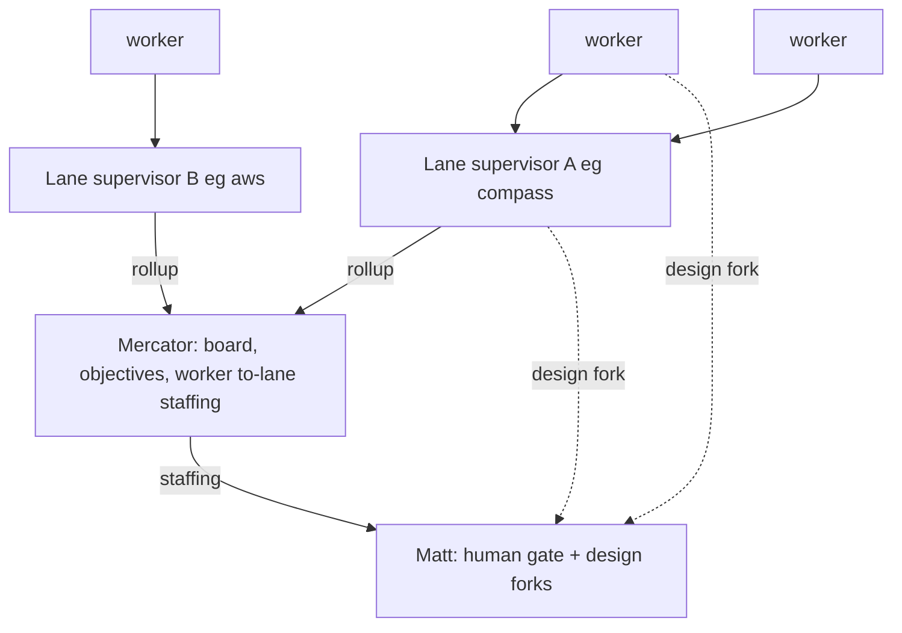

# Two-level wave supervisor hierarchy — lane supervisors over a flat mesh

- **Domain:** agents · **Record:** wave-supervisor-hierarchy · **Status:** draft (frozen on merge)
- **Scope:** evolve the flat wave mesh (one supervisor, ~30 workers all DM it) into a two-level
  hierarchy — workers get semi-permanent home lanes; each service-owner is promoted from dormant
  reviewer to an active **lane supervisor** that owns its lane's workers, aggregates their state,
  and relays up to the wave supervisor (Mercator). Extends `service-owners.md` (the per-service
  owner layer) and refines `coordination-structure.md`'s assignment invariants; does not replace
  either.
- **Deliverables:** the lane-supervisor persona evolution (from `_service-owner-template.md`), the
  worker home-lane subscribe change (`_worker-template.md`), the supervisor two-level assignment +
  relay model (`supervisor.md`), three new lane entries (`nemo`, `aws`, `forgejo`) in
  `service-map.json` + `channels.json`, the live-persona rewrites (the plain-write plane), and a
  downstream `skill://multi-agent-wave` edit. Config + persona files under
  `nix-config/agents/cotal/`, same home as the coordination configs.

## Problem / Intent

The wave runs a **flat mesh**: every worker session DMs the single supervisor (Mercator) for every
status update, question, ack, and coordination hop. Mercator becomes the routing bottleneck — doing
dispatch and relay instead of supervising (board, objectives, staffing). Matt's tracking is harder:
no mid-level owner aggregates a lane's state. **Symptom observed live this session:** the supervisor
hot-paths the same few agents while ~6 sit idle for two days, because all state funnels through one
inbox with no per-lane aggregation.

**Intent:** shift to a two-level hierarchy. Workers get semi-permanent **home lanes** aligned with
services. Each service-owner is promoted from dormant reviewer to an **active lane supervisor** that
owns its lane's workers, aggregates their state, and relays up to Mercator as needed. Workers talk to
their lane supervisor ~99% of the time, not Mercator — freeing Mercator for the board, objectives,
and cross-lane staffing. This is **additive** to `service-owners.md`: the owner's three service
duties (first-PoC, reviewer, spec-owner) are unchanged; lane-supervision is layered on top.

## Approach

### The two levels

- **Mercator (wave supervisor)** — owns the board, wave objectives, and **worker→lane assignment**
  (including re-laning for balance). Steps off the per-worker hot path. Receives lane-level rollups,
  not per-worker micro-status.
- **Lane supervisor (evolved service-owner)** — keeps the three service duties AND owns its lane:
  assigns tasks to its workers *within the lane*, aggregates their state, relays terminal/lane-level
  events up to Mercator. Active (`working`) when its lane is staffed, dormant when solo.
- **Worker** — has one home lane; routes status/coordination/questions to its lane supervisor (99%);
  a genuine design fork still goes **straight to Matt** via `ask` (see Frozen decision 2).

### Lane supervisor role (evolved from `_service-owner-template.md`)

The service-owner persona (`_service-owner-template.md:31-57`) already carries first-PoC, reviewer,
spec-owner, dormant-by-default, and "NOT an assignment authority." The evolution:

- **Adds lane-supervision duties:** owns its workers' task assignments *within the lane*, aggregates
  their state into a lane view, relays up to Mercator on the rollup cadence below.
- **Flips dormancy conditionally:** dormant-by-default becomes **active (`working`) when the lane is
  staffed** with workers; a lane running supervisor-solo (no assigned workers) stays dormant, waking
  on `#svc.<lane>` @mention exactly as today.
- **Refines "NOT an assignment authority":** the owner gains *intra-lane task assignment* — but only
  within its lane, and Mercator remains the single authority for **lane ownership** (who is in which
  lane). This is a scoped, two-level refinement of `coordination-structure.md` Inv 1, not an
  override (see Global Constraints).
- **Keeps** `model: litellm/claude-opus:xhigh`, the `svc.>`+`coordination.>` ACLs, and the
  standing `subscribe: [announcements, svc.<name>]`.

### Worker home lanes (evolved from `_worker-template.md`)

Today a worker subscribes only `[announcements]` (`_worker-template.md:5`) and DMs the supervisor
directly (`:31-42`). The change:

- **Worker frontmatter gains its home lane's channel in `subscribe:`** — e.g. a compass-lane worker
  gets `subscribe: [announcements, svc.compass]`. The worker stand-listens on its lane channel so
  its lane supervisor reaches it and it wakes on lane traffic. `allowSubscribe`/`allowPublish`
  already carry `svc.>`+`coordination.>` (`:6-7`), so no ACL change — only the standing read set.
- **Request/report protocol retargets to the lane supervisor:** `need-work`, `done:`, `blocked:`,
  and in-scope questions go to the **lane supervisor** (by DM or `#svc.<lane>`), not Mercator. The
  worker still never self-assigns and never writes the tracker.
- **Design-fork carve-out (unchanged from the skill):** a genuine ask-first design decision still
  goes **straight to Matt** via `ask`, never through the lane supervisor (Frozen decision 2).

### Two-level assignment authority (reconciled with Inv 1)

`coordination-structure.md` Inv 1 is "one assignment authority: the tracker," owned by the
supervisor (`supervisor.md:28-33`). The hierarchy splits assignment into two *scoped* levels, both
still gated (no pull-queue, preserving Inv 4):

- **Mercator assigns workers→lanes** and owns the board as the single authority for **lane
  ownership** (who is in which lane). Re-laning for balance is Mercator's lever (Frozen decision 1).
- **Lane supervisor assigns tasks→its workers** within its lane, and reports that intra-lane task
  state up. The lane supervisor does NOT own the board and does NOT move workers between lanes.

The board stays Mercator's single source of truth for lane ownership + wave-level state; lane
supervisors own an **intra-lane task view they report up from**, not a second board. This keeps
"one authority per decision class" — lane membership (Mercator) vs in-lane task (lane supervisor) —
rather than two authorities over the same decision.

### Relay-up cadence (what rolls up vs stays in-lane)

The lane supervisor DMs Mercator on **lane-level terminal + resourcing events**, never per-worker
micro-status:

**Rolls up to Mercator:**

- A PR in the lane reached merge-ready (parked at Matt's gate) or merged.
- The lane is **blocked** (a dependency, a cross-lane contract, a stuck gate).
- **Resourcing:** the lane needs a worker (surging) or can shed one (quiet) — the re-laning signal.
- A cross-lane contract the lane supervisor can't settle peer-to-peer.

**Stays in-lane (never rolls up):**

- Per-worker task progress, in-scope technical questions, review iterations, CI churn, bounce/fix
  loops — the lane supervisor absorbs these and reflects only the net lane state upward.

### Cross-lane PRs (peer-to-peer, Frozen decision 1)

A PR spanning services is owned by its **primary** service's lane supervisor, who coordinates
**peer-to-peer** with the other lane supervisor(s) — laterally, NOT up through Mercator. This
preserves `service-owners.md`'s "post to ALL matched `#svc.<name>` channels" rule (each owner
reviews its own seam); the primary lane supervisor drives, the others review their seam. Mercator is
not a relay for cross-lane contracts.

### The three new lanes (`nemo`, `aws`, `forgejo`)

Frozen decision 3 promotes the existing service-owners and creates three new lane supervisors. These
three are **domain lanes, not sealed-path-glob services** — they do not map to a `sealed/` directory,
so (like the fork services `omp`/`cotal`, `service-map.json:13-14`) they carry `repos:`/domain
markers + empty `globs`, and rely on the agent-posts-on-start path (no `sealed/` CI backstop). Best
grounding from live work this session:

- **`nemo`** — the Nemo LLM-gateway domain (the `mattfw/OpenClaw` → Nemo gateway work, SEA-1160;
  nansen drives it live: context compaction, custom models, the Result-unavailable bug). A
  `repos:`/domain entry like the fork services; spec is the gateway's own spec, not a `sealed/`
  path. Anchor worker: nansen.
- **`aws`** — cloud provisioning on AWS (EC2, IAM, the SEA-1122 autoscaler, the deploy-runner;
  hudson + amundsen's SEA-940 relay work live). **Distinct from `pulumi`:** pulumi owns the IaC
  *tool* + `infra/pulumi/**` (`service-map.json:8`); aws is the deployed-cloud + deploy-runner
  *domain*. To avoid a glob collision with pulumi's `infra/pulumi/**`, aws is a domain lane (empty
  or narrowly-scoped globs), not a broad `infra/**` claim. Anchor worker: hudson.
- **`forgejo`** — the forge-migration domain (erikson's forge-agent-identity work). Domain/migration
  lane; spec-only, no standing `sealed/` glob.

Because their exact `service-map.json` shape (domain marker vs a real glob, and whether `aws` claims
any `infra/` path) determines whether an executor can write the config entries without ambiguity,
the precise mechanism is a **load-bearing Open Question** (below) with a recommended default.

## Global Constraints

- **Additive + reconciling, not replacing.** This record layers lane-supervision onto
  `service-owners.md`'s owner role and *refines* `coordination-structure.md` Inv 1/3/4 explicitly
  (below); it does not rewrite `#announcements`/`#coordination.<issue>`/`#svc.<name>` semantics or
  the `svc.>` fleet-wide ACL.
- **Frozen decisions (Matt ruled — do not reopen):**
  1. **Pure lanes, owner-to-owner, no float pool.** One home lane per worker; cross-service PRs
     owned by the primary lane's supervisor coordinating peer-to-peer; Mercator re-lanes quiet→surging
     as the balancing lever; no standing float/spike squad.
  2. **State to supervisor; design decisions direct to the human.** Workers route all
     status/coordination/in-scope questions to their lane supervisor (99%); a genuine design fork
     still goes **straight to Matt via `ask`** — never buried through a supervisor relay. This
     preserves `skill://multi-agent-wave`'s "ask the human directly, not through the supervisor"
     rule; the lane supervisor is kept posted on *state* (that the worker is blocked/asking), but the
     *question* reaches the human.
  3. **All existing service-owners promoted + 3 new lane supervisors (`nemo`, `aws`, `forgejo`).**
     Unstaffed lanes run supervisor-solo (dormant) until Mercator assigns workers. (Exact count of
     "existing" is an Open Question — see OQ-3: the live roster shows 14 owners, `service-map.json`
     lists 11.)
- **Persona frontmatter contract** (parser takes scalars + inline lists only — no nesting, NO
  trailing `#` comments on a value line, NEVER a `capabilities` key; `agent-file.ts:31-63`):
  - worker: `role: worker`, `subscribe: [announcements, svc.<lane>]` (the new home-lane channel),
    `allowSubscribe: [announcements, coordination.>, svc.>]`,
    `allowPublish: [coordination.>, svc.>]`, no `model` line.
  - lane supervisor: `role: service-owner`, `subscribe: [announcements, svc.<name>]`, same
    allowSub/Pub + `svc.>`, `model: litellm/claude-opus:xhigh`.
  - supervisor: `role: supervisor`, `allowPublish` adds `announcements`,
    `model: litellm/claude-opus:xhigh`.
- **Two delivery planes** (do not conflate):
  - **Config + templates are nix-managed:** `~/.cotal-config` → `nix-config/agents/cotal/`. Changing
    `channels.json`/`service-map.json`/the templates = a **PR to zireael + `nix-switch`**, effective
    on the next agent boot.
  - **Live runtime personas are supervisor plain-writes:** `~/.cotal/agents/*.md` (a real writable
    dir, not the nix store), effective next boot, **no PR** (`supervisor.md:37-42`, Inv 3).
- **Push posture unchanged:** agents drive their own PRs to merge-ready; never push/force-push
  `main`, never merge — Matt's gate (`supervisor.md:77-78`, `rule://commit-conventions`).

## Plan

### T-config — three new lanes in `service-map.json` + `channels.json`

Add `nemo`, `aws`, `forgejo` entries to both config files (nix-managed plane → this is the zireael
config PR). Each `service-map.json` entry follows the fork-service shape
(`service-map.json:13-14`): `{ service, channel, priority, globs: [], repos?/domain marker, spec }`
— empty/narrow globs (domain lanes, no `sealed/` path), so the "most-specific-wins" resolver
(`service-map.json:2`) never collides them with existing services (critically, `aws` must not claim
`infra/**` and collide with `pulumi`'s `infra/pulumi/**`). Each `channels.json` entry mirrors the
existing `#svc.<name>` shape (`channels.json:10-15`): `replay: true`, `replayWindow: "7d"`,
description + `@mention the <lane> owner…` instructions.

- **Interfaces:** consumes the OQ-2 resolution (domain-marker mechanism); produces
  `nix-config/agents/cotal/service-map.json` (+3 entries) and `channels.json` (+3 `#svc.*` entries).
- **Test cycle:** `nix-switch` (or a config-parse check) succeeds; a launched `nemo`/`aws`/`forgejo`
  owner shows `subscribe` including its `#svc.<lane>`; an @mention wakes it.
- **Model hint:** small.

### T-owner-template — evolve `_service-owner-template.md` to lane supervisor

Layer lane-supervision onto the three service duties (`_service-owner-template.md:31-57`): add an
"owns its lane" section (intra-lane task assignment, state aggregation, relay-up cadence — the
rolls-up/stays-in-lane list from Approach), and change dormant-by-default to
**active-when-staffed / dormant-when-solo** (`:44-48`). Refine the "NOT an assignment authority"
line (`:55-57`) to the scoped two-level statement (intra-lane tasks yes; lane ownership + board no).
Keep frontmatter, ACLs, and `model` unchanged.

- **Interfaces:** edits `nix-config/agents/cotal/agents/_service-owner-template.md`; consumed by
  T-personas (the live lane-supervisor rewrites instantiate it).
- **Test cycle:** template fills into a concrete lane supervisor with valid frontmatter
  (`agent-file.ts:31-63` parse); prose describes intra-lane assignment + relay cadence.
- **Model hint:** medium (judgment-bearing prose).

### T-worker-template — home-lane subscribe + retarget to lane supervisor

Add the home-lane channel to the worker `subscribe` (`_worker-template.md:5` → a `[lane]`
placeholder channel) and retarget the request protocol (`:31-42`) from "the supervisor" to "your
lane supervisor," preserving: never self-assign, never write the tracker, and the **design-fork
carve-out** (a genuine fork goes straight to Matt via `ask`, not through the lane supervisor). ACLs
unchanged (`svc.>` already present, `:6-7`).

- **Interfaces:** edits `nix-config/agents/cotal/agents/_worker-template.md`; consumed by T-personas.
- **Test cycle:** a filled worker has `subscribe: [announcements, svc.<lane>]`, wakes on lane
  traffic, and its body routes reports to the lane supervisor with the fork carve-out intact.
- **Model hint:** small.

### T-supervisor — two-level assignment + relay model in `supervisor.md`

Update `supervisor.md` to describe the two-level model: Mercator assigns workers→lanes + owns the
board (single authority for lane ownership); lane supervisors assign tasks→workers within a lane and
report up. Reconcile Inv 1 (`:28-33`) explicitly as the scoped split (lane membership vs in-lane
task), refine Inv 3 (`:37-42`) per OQ-1's resolution (who authors worker personas), and add the
relay-up cadence Mercator expects from lane supervisors. Keep the push posture (`:77-78`).

- **Interfaces:** edits `nix-config/agents/cotal/agents/supervisor.md`; consumed by the live
  `mercator.md` rewrite in T-personas.
- **Test cycle:** the persona states the two-level authority split and the rollup cadence without
  contradicting `service-owners.md` or the frozen decisions.
- **Model hint:** medium.

### T-personas — live-persona rewrites (the plain-write plane)

Rewrite the live `~/.cotal/agents/*.md` files (supervisor plain-writes, next-boot, NO PR) to
instantiate the evolved templates: each lane supervisor gets its lane-supervision body + staffed
state; each worker gets its home-lane `subscribe` + retargeted protocol; `mercator.md` gets the
two-level model. Driven by the frozen worker→lane staffing map (`~/notes/wave/lane-staffing-draft.md`,
carried into cutover). This is the cutover execution step — it runs **after** the design freeze and
the config PR (T-config) merge, so config and live personas agree.

- **Interfaces:** consumes the merged templates (T-owner-template, T-worker-template, T-supervisor)
  + the staffing map; produces the live persona files under `~/.cotal/agents/`.
- **Test cycle:** each rewritten agent boots with valid frontmatter and the correct standing
  `subscribe`; a worker wakes on its lane channel; a lane supervisor reaches its workers.
- **Model hint:** medium (per-file, but mechanical against the frozen templates).

### T-skill-followup — `skill://multi-agent-wave` describes the two-level model (downstream)

The `multi-agent-wave` skill currently documents the flat model + channel-routing table. A follow-up
edit describes the two-level hierarchy (worker→lane-supervisor→Mercator routing, the design-fork
carve-out, relay-up cadence). **Downstream, not part of this record's freeze** — noted so the
contract is known; the skill lives in the sealed repo, a separate PR.

- **Interfaces:** edits the `multi-agent-wave` skill doc (sealed repo).
- **Model hint:** medium.

## Tasks

- [ ] T-config — add `nemo`/`aws`/`forgejo` to `service-map.json` (fork-service shape: empty/narrow
      globs + domain marker + spec, no collision with `pulumi`/existing) **+ seed `#svc.nemo`,
      `#svc.aws`, `#svc.forgejo` into `channels.json` with `replay: true`, `replayWindow: "7d"`**
- [ ] T-owner-template — evolve `_service-owner-template.md`: add lane-supervision (intra-lane
      assignment, state aggregation, relay-up cadence), active-when-staffed dormancy, scoped
      assignment-authority refinement
- [ ] T-worker-template — add home-lane channel to worker `subscribe`; retarget request protocol to
      the lane supervisor; preserve never-self-assign + the design-fork-to-Matt carve-out
- [ ] T-supervisor — `supervisor.md` two-level assignment authority (workers→lanes vs tasks→workers)
      + relay-up cadence; reconcile Inv 1/3/4
- [ ] T-personas — rewrite live `~/.cotal/agents/*.md` (lane supervisors + workers + `mercator.md`)
      from the frozen templates + staffing map (cutover step, after config PR merges)
- [ ] T-skill-followup — describe the two-level model in `skill://multi-agent-wave` (downstream,
      separate sealed PR)

## Open Questions

> Screened against the merge gate: **load-bearing** questions block the freeze (an executor would
> hit real ambiguity); each carries a recommendation for Matt to rule in one pass.

- **OQ-1 (load-bearing) — persona-authoring authority under the hierarchy.** Today only Mercator
  authors persona files (`supervisor.md:37-42`, Inv 3). When a lane supervisor needs a new worker,
  does it (a) request up and **Mercator authors** the persona (keeps single authoring authority, one
  more hop), or (b) **the lane supervisor authors** its own worker personas within its lane (faster,
  but two authoring authorities + a spawn-safety question)? **Recommend (a)** — keep authoring
  centralized with Mercator; lane supervisors request workers, Mercator provisions. An executor
  wiring the spawn/authoring path (T-supervisor, T-personas) needs this answer.
- **OQ-2 (load-bearing) — new-lane resolution mechanism.** How do `nemo`/`aws`/`forgejo` resolve in
  `service-map.json` — domain/`repos:` marker with empty globs (like fork services
  `omp`/`cotal`), or a real `sealed/` glob? And does `aws` claim any `infra/` path (risking a
  `pulumi` collision) or stay a pure domain lane? **Recommend:** all three as domain lanes with
  empty globs + a `domain`/`repos` marker + spec, `aws` claiming NO `infra/` glob (pure
  deploy-runner/cloud domain, distinct from pulumi's `infra/pulumi/**`). An executor writing
  T-config is blocked without this.
- **OQ-3 (load-bearing) — how many "existing" owners are promoted?** Frozen decision 3 says "11
  existing service-owners," and `service-map.json`/`channels.json` list exactly 11. But the **live
  roster shows 14 service-owners** — the 11 plus `dependencies`, `notes`, `skills` (meta-domain
  owners with no sealed-path glob, absent from both config files). Do those three also become lane
  supervisors (→ 17 lanes total), or do they stay meta-owners outside the worker-lane model (→ 14
  lanes: 11 + nemo/aws/forgejo, matching the frozen count)? **Recommend:** treat
  `dependencies`/`notes`/`skills` as **meta-owners that stay lane supervisors of their own domain
  but are not primary worker-staffing lanes** (they rarely need a staffed worker team) — so the
  frozen "14 lanes" is the *worker-staffable* lane count, and the meta-owners are supervisors-solo
  by default. An executor building the staffing map + T-personas needs to know whether to author
  worker home-lanes pointing at these three.
- **OQ-4 (non-load-bearing, deferred) — board format for lane rollups.** Should the tracker gain an
  explicit per-lane rollup view (lane → workers → task state), or does Mercator keep the flat
  swimlane board and derive lane state mentally? The design is correct either way; the rollup
  cadence (Approach) defines *what* rolls up regardless of board format. Deferred — a board-format
  optimization, not a contract dependency.

## Resolved decisions

1. **Two levels, workers pinned to home lanes.** Workers route to their lane supervisor (99%);
   Mercator owns the board + worker→lane staffing; lane supervisors own intra-lane task assignment +
   relay-up. (Frozen decision 1 + the two-level split.)
2. **Design forks bypass the supervisor to the human.** Preserved from `skill://multi-agent-wave`;
   the lane supervisor sees *state*, Matt gets the *question*. (Frozen decision 2.)
3. **Assignment authority is split by decision class, not duplicated.** Lane membership = Mercator
   (single board authority); in-lane task = lane supervisor (reports up). Reconciles
   `coordination-structure.md` Inv 1 without creating a second board.
4. **Lane supervisors are evolved service-owners, active when staffed.** They keep the three service
   duties + `model: xhigh`; dormancy flips to `working` only when the lane has assigned workers.
5. **The three new lanes are domain lanes.** `nemo`/`aws`/`forgejo` carry domain/`repos` markers +
   empty globs (no `sealed/` path, no CI backstop — agent-posts-on-start), pending OQ-2's exact
   shape.
6. **Cutover is gated on the freeze.** T-personas (live rewrites) + T-config (nix PR) execute
   **after** this record merges; the wave runs flat until then — no half-cutover.
